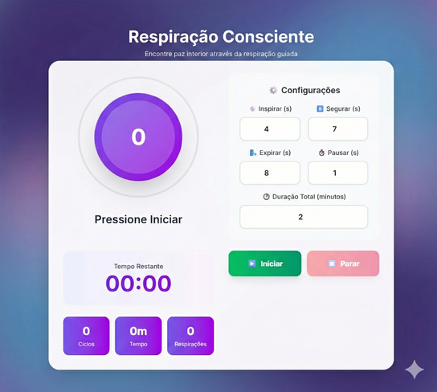

# Respiração Consciente (Conscious Breathing App)



Uma aplicação web moderna e interativa projetada para auxiliar na prática de exercícios de respiração guiada. O objetivo é ajudar os usuários a encontrar paz interior, reduzir o estresse e melhorar o foco através de técnicas de respiração controlada.

## 🌟 Funcionalidades

- **Respiração Guiada:** Ciclos visuais e auditivos para guiar a respiração (Inspirar, Segurar, Expirar, Pausar).
- **Personalização:** Ajuste a duração de cada fase da respiração (Inspirar, Segurar, Expirar, Esperar) e o tempo total da sessão.
- **Visualizador Interativo:** Animações suaves que acompanham o ritmo da respiração para uma experiência imersiva.
- **Estatísticas em Tempo Real:** Acompanhe o número de ciclos, respirações completas e o tempo decorrido durante a sessão.
- **Interface Moderna:** Design limpo e responsivo, focado na experiência do usuário e relaxamento.

## 🛠️ Tecnologias Utilizadas

Este projeto foi desenvolvido utilizando as seguintes tecnologias:

- **[React](https://react.dev/):** Biblioteca JavaScript para construção de interfaces de usuário.
- **[Vite](https://vitejs.dev/):** Ferramenta de build rápida e leve.
- **[TypeScript](https://www.typescriptlang.org/):** Superset do JavaScript que adiciona tipagem estática.
- **[Tailwind CSS](https://tailwindcss.com/):** Framework CSS utility-first para estilização rápida e moderna.

## 🚀 Como Executar o Projeto

Siga os passos abaixo para rodar a aplicação em seu ambiente local:

1. **Clone o repositório:**
   ```bash
   git clone <URL_DO_SEU_REPOSITORIO>
   cd conscious-breathing-app
   ```

2. **Instale as dependências:**
   Certifique-se de ter o [Node.js](https://nodejs.org/) instalado.
   ```bash
   npm install
   ```

3. **Inicie o servidor de desenvolvimento:**
   ```bash
   npm run dev
   ```

4. **Acesse a aplicação:**
   Abra o seu navegador e acesse o endereço indicado no terminal (geralmente `http://localhost:5173`).

## ⚙️ Scripts Disponíveis

- `npm run dev`: Inicia o servidor de desenvolvimento.
- `npm run build`: Compila a aplicação para produção.
- `npm run preview`: Visualiza a versão de produção localmente.

## 📝 Licença

Este projeto está sob a licença MIT. Sinta-se à vontade para usar, modificar e distribuir.
